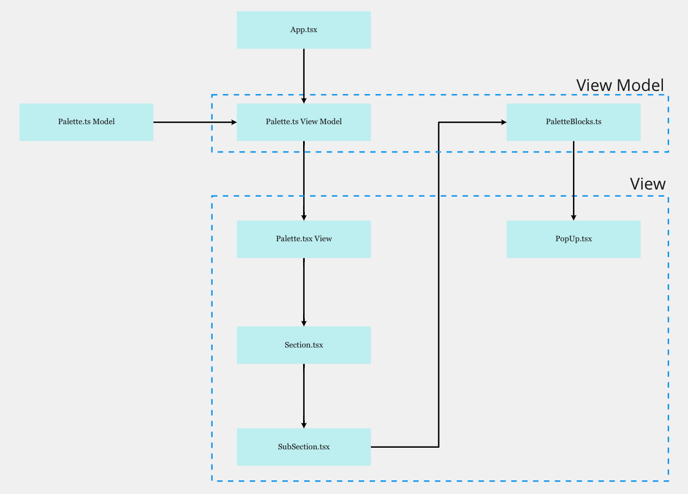

# Palette 

The palette is divided into three components according to the MVVM model. 
<ol> 
<li> Model
<li> View Model
<li> View 
</ol> 



## Palette Model
This model is used to store which palette is selected (_selectedSection) and whether to show the subSection or not (_hideSubSection). This model called by the `palette.ts` model.


## Palette View Model

This view Model contains 2 file:
<ol>
<li> Palette.ts
<li> PaletteBlocks.ts
</ol>

Palette.ts renders the sections [Music, Art, Logic] and there corresponding subSections. PaletteBlocks.ts renders the popUp when a subSection is selected. It also renders the blocks in the popUp.

### Palette.ts
Different variables are defined in palette.ts to help control hiding and showing of the sections and subsections.

Parameter | type | Description
-- | -- | -- 
sections | string[] | Stores the section the users see when they open the palette i.e. Music, Art, Logic
subSections | string[] | Stores the subSections of the section. For example for music section, the subSections are rhythm, pitch, meter, intervals, tone, oranament etc.
selectedSection | number | Stores the index of the seclected section.
hideSubSections | boolean | Hide the subSections when true. The default value is true, showing all the subSections are hidden initally.
openSection | number | The index of the section that is open. The default value is -1, showing no subSection is opened when the musicBlocks starts.

To change the selected Selection, the following function is defined:

```
const changeSelectedSection = (index: number) => {
        if (openedSection === index) {
            toggleHideSubSection(true);
            setOpenedSection(-1);
        } else {
            PaletteModel.changeSelectedSection(index);
            setSelectedSection(PaletteModel.selectedSection);
            setOpenedSection(PaletteModel.selectedSection);
            toggleHideSubSection(false);
        }
    };
```

If the openedSection is equal to the section user is clicking on, the function hides that opened section and setOpenedSection to -1. Otherwise, the function changes the selectedSection and setOpenedSection to the section user has clicked on.

### PaletteBlocks.ts
The blocks in the new version of musicBlocks are divided into 2 categories:
<ol>
<li> high Shelf Blocks : The high shelf blocks contains the blocks that are mostly used by the user and can be easy found.
<li> low Shelf Blocks : The high shelf blocks contains the blocks that are rarely used and can be grouped together with other blocks.
</ol>

The blocks are stored in the following format:

Type | Description
-- | --
string | The block is a high shelf block and the string stores the block name.
[string] : string[] | The block is a low shelf block. It is stored in an hashmap, the key stores the name of the groups of blocks and the values stores the blocks in that group.

The `blockList` is an array of both the formats.

The low shelf blocks are stored in an accordion, and the `openAccordion(highShelf)` function is defined to toggle between closing and opening the accordion with `highShelf` name as a parameter.

This view Model calls th PopUp View to render the blocks in low and high shelf.

## Palette View
The view contains the scss file and the JSX files to render and style the palettes. There are 4 views and their corresponding scss files. <br/>

<ol>
<li> Palette.tsx
<li> Section.tsx
<li> SubSection.tsx
<li> PopUp.tsx
</ol>

The palette is the entry point for the view, and the below image shows how the remaining 3 files are used to render which component.


### Palette.tsx
Loops through the sections list and calls `Section.tsx` to render each section.

### Section.tsx
On clicking on a section, changeSelectedSection() is called to render the subSections by calling `subSection.tsx`.

### SubSections.tsx

It loops through the subSections list to render all the subSections, and when hovered over any subSection it shows the name/small description of the subSection and onClicking on the subSection, it calls `PaletteBlocks.ts` view Model to render the blocks.

### PopUp.tsx
Loops through the blockList which is an array of both string and [string]:string[]. If the type is string, it simply renders the block. If the type is [string]:string[], it renders the accordion. <br/>

If an accordion is clicked, it calls openAccordion() function to toggle the accordion. To open the accordion the className changes to `active` otherwise it remains `body`.

```
<div className={
    props.openLowShelf && props.selectedHighShelf === highShelf ? 'active' : 'body'
    }
>
```

To render the low shelf blocks in the accordion, the string[] is iterated over to render blocks.

